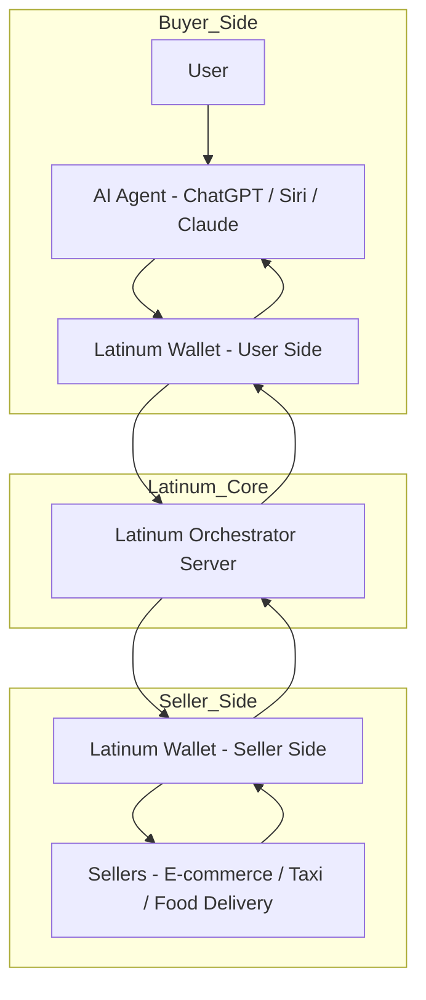
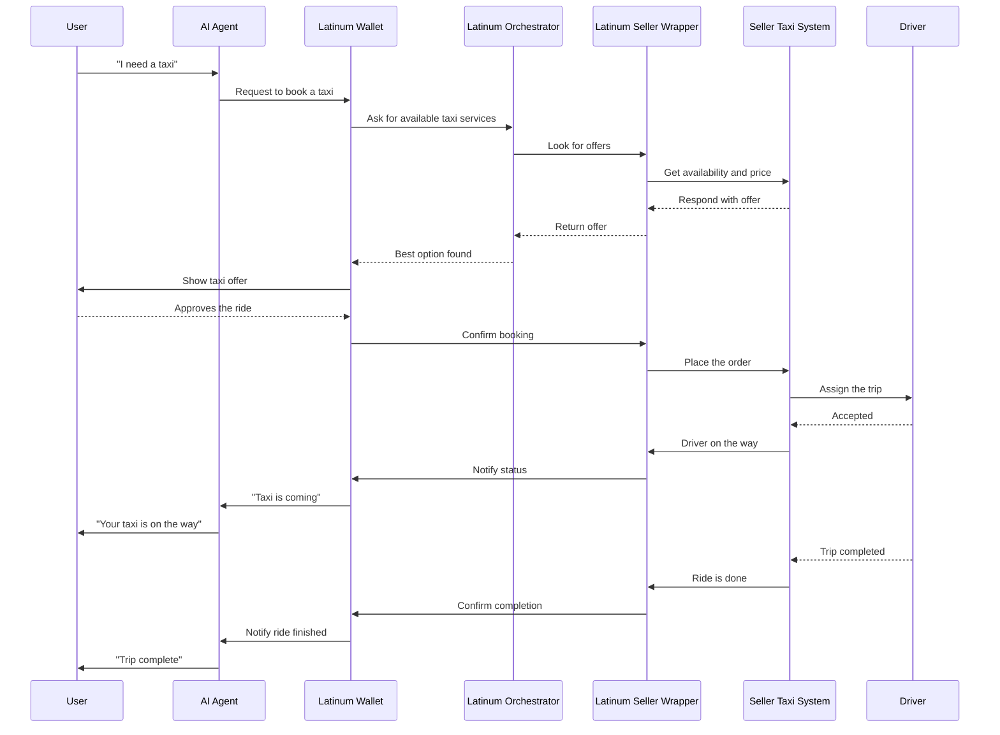
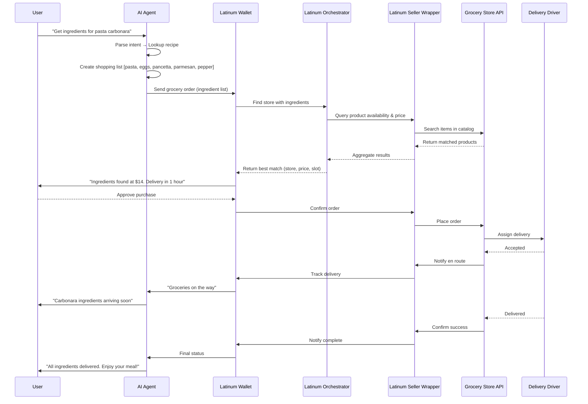

# Latinum
WHY?
> We believe conversations shouldn’t end in answers — they should end in action.

WHAT?
> Latinum is the connection between AI agents and the real-world economy.

HOW?
> Latinum is the transaction layer powering identity, payments, order orchestration, and trust between agents and sellers.

In the next few years, most online transactions will be made by AI agents on behalf of humans.
Latinum gives them the power to buy — safely, instantly, and autonomously. We turn conversations into transactions.

On the seller side, we provide everything needed to serve AI-native customers: user identification, order processing, delivery coordination, catalog search, availability handling, and payment settlement.

On the buyer side, we offer a wallet and identity layer that works with popular AI personal agents like ChatGPT, Siri, Claude, etc — allowing them to make purchases with user approval.

Latinum orchestration system routes each request to the best available provider — based on geography, price, availability, trust, and user preferences.

# Simplified Latinum Taxi

# Latinum Grocery delivery

# Complete Latinum Taxi

# Press Release

Latinum has launched the first infrastructure platform built for the age of AI agents — enabling assistants like ChatGPT, Siri, and Claude to discover, trust, and transact directly with real-world businesses.
As AI agents rapidly become the primary interface for consumer intent, Latinum provides the critical bridge between agent and economy — turning intelligent requests into fulfilled transactions.
Latinum is the first platform built for agent-native commerce — enabling AI assistants to find, trust, and transact with real-world businesses.
For sellers, Latinum is a single integration that exposes their services to a growing network of intelligent agents — handling identity, catalog discovery, checkout, fulfillment, and trust.
For agents, Latinum provides a secure wallet with user-linked identity, location, and payment — plus access to an orchestration and rating engine that selects the best provider for every task, in real time.
> “We turn AI conversations into real-world transactions,” said Dennj Osele, CTO of Latinum.
“Latinum is the bridge between intelligent agents and the global economy.”

Unlike existing platforms designed for human interfaces, Latinum is built from the ground up for AI agents acting on human intent — making it the missing layer in agentic commerce.
The platform is now live with early partners including Shuppa, Manna Drones, and SuperValu, powering use cases like grocery delivery, local shopping, and instant logistics.

# Parallel with Shopify

Latinum is the Shopify for AI agents. Like Shopify, we manage product catalogs, expose search functionality, verify buyers, and process transactions. But instead of a human-facing UI, our services are built for AI agents — handling geographic restrictions, multi-provider orchestration, and fulfillment logic.
By removing the need for human interfaces, Latinum can also support taxi companies, food delivery services, and businesses with online booking systems.
Personal AI agents will be the access point to our services, much like browsers are the access point for Shopify. But, we don’t build an AI agent because we believe each phone will eventually have one default personal agent, just as every phone today has one browser.

**Why don’t we build our own AI agent?**
We expect AI agents to converge in capability and be dominated by smartphone OS providers: Google (Gemini), Apple (Siri), and Amazon (Alexa). Once Siri and Gemini match ChatGPT in intelligence, there’s little room — or user demand — for extra AI agent apps.
OpenAI, Anthropic, and Perplexity are already shifting toward professional agents, while Meta is pushing AI across its platforms to compete in the personal space.
Latinum is designed to be compatible with all major personal AI agents, but current support for third-party integrations is limited. Even innovative players like Anthropic have cumbersome installation systems.
We built a standalone Latinum app using OpenAI APIs, with our components pre-installed to address this. We'll continue supporting this app until major personal AI agents start offering an accessible integrations store.